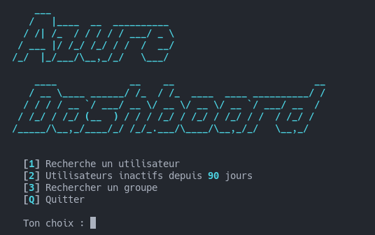
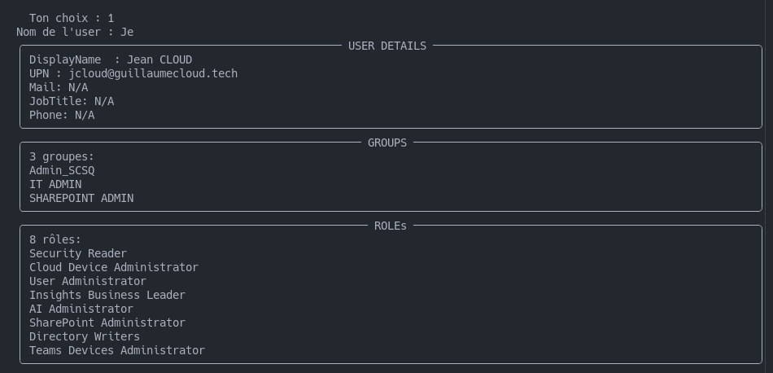
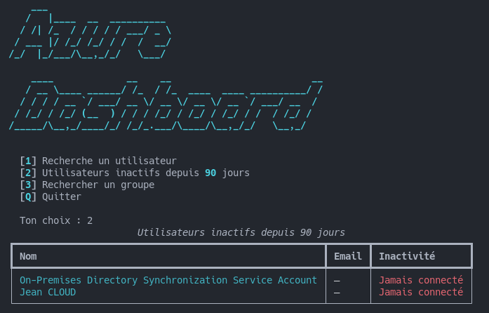
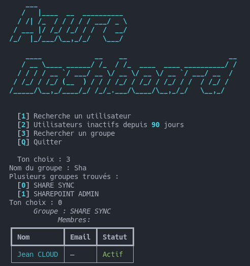

# ☁️ Azure Dashboard

> Dashboard terminal pour administrer un tenant Azure/Entra ID via Microsoft Graph API.


---

## Fonctionnalités

| Option | Description |
|--------|-------------|
| 🔍 Recherche utilisateur | Affiche les détails, groupes et rôles Entra ID d'un utilisateur |
| 👥 Membres d'un groupe | Liste les membres d'un groupe avec leur statut |
| ⚠️ Utilisateurs inactifs | Détecte les comptes inactifs depuis 90 jours |

---

## Aperçu






---

## Installation

```bash
pip install azure-identity requests rich pyfiglet
```

---

## Configuration

Créez un fichier `config.py` à la racine du projet :

```python
TENANT_ID     = "ton-tenant-id"
CLIENT_ID     = "ton-client-id"
CLIENT_SECRET = "ton-client-secret"
```
---

## Permissions requises (App Registration)

Dans **Entra ID → App Registrations → API Permissions** :

| Permission | Type | Usage |
|------------|------|-------|
| `Group.Read.All` | Application | Lecture des groupes |
| `User.Read.All` | Application | Lecture des utilisateurs |
| `AuditLog.Read.All` | Application | Dernière connexion |
| `RoleManagement.Read.Directory` | Application | Rôles Entra ID |

> N'oubliez pas de cliquer sur **Grant admin consent** ✅

---

## Structure du projet

```
azure-dashboard/
├── main.py                  # Point d'entrée — menu interactif
├── auth.py                  # Authentification OAuth2
├── config.py                # Identifiants Azure (A créer)
├── services/
│   ├── graphclient.py       # Appels Microsoft Graph API
│   └── __init__.py
└── display/
    ├── print_groups.py      # Affichage des groupes
    ├── print_users.py       # Affichage des utilisateurs
    ├── search_functions.py  # Logique de sélection interactive
    └── __init__.py
```

---

## Lancement

```bash
python main.py
```